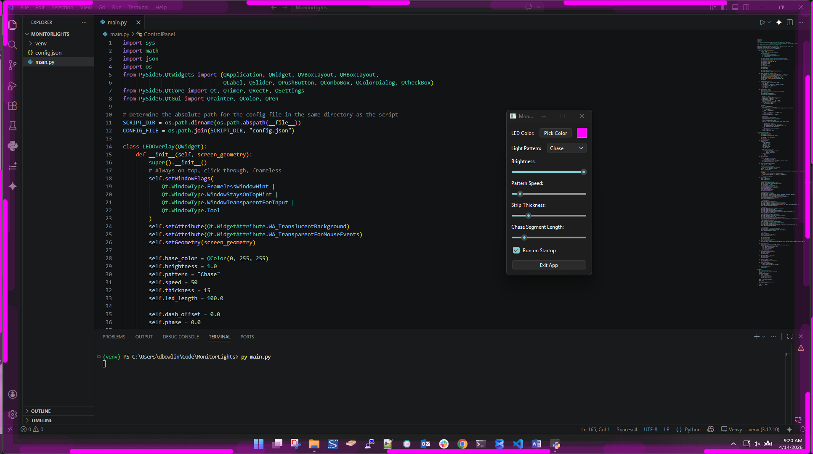

# Monitor LED Lights

A Python app that draws a glowing LED light strip around the edges of each detected monitor. Built with PySide6, it supports multiple animation patterns, configurable color/brightness/speed/thickness, per-segment length for chase effects, and persistent configuration.



## Features
- Multi-monitor support (detected at startup)
- Always-on-top, click-through transparent LED borders
- Patterns: Solid, Chase, Breathing, Rainbow, Strobe
- Configurable: color, brightness, animation speed, strip thickness, chase segment length
- Save and load configuration from `config.json`
- Optional: Run on Windows startup (per-user registry entry)
- Cross-platform (Windows, macOS, Linux)
---
## Recent Changes
- *** Added chase:rainbow to the available patterns ***
- *** Reduced the "ghosting" effect of the chase patterns ***
---
## Quick Start

1. Activate your virtual environment (if applicable):

```powershell
& .\venv\Scripts\Activate.ps1
```

2. Run the app:

```powershell
python.exe main.py
```

The **Monitor LED Config** window appears and controls all overlays. Close the window or press **Exit App** to quit.

## Configuration
- Settings are saved to `config.json` in the same folder as `main.py`.
- Use the **Run on Startup** checkbox to enable/disable a per-user registry entry on Windows.

## App Icon
- The app icon assets live in `assets/`:
  - `assets/monitorlights_icon.png`
  - `assets/monitorlights.ico`
- The app loads `assets/monitorlights.ico` at runtime for the window/taskbar icon.

## Build (Windows EXE with icon)
Use PyInstaller with the bundled `.ico` so Explorer and shortcuts use the same base icon:

```powershell
pyinstaller --noconfirm --windowed --onefile --name MonitorLights --icon assets/monitorlights.ico main.py
```

## License
[MIT](LICENSE)
